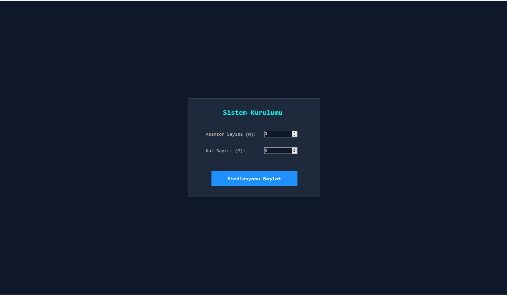

# Multi-Floor Intelligent Elevator Management System (DFA Engine)

A deterministic, multi-floor, multi-car intelligent elevator simulation built with **C# (.NET Framework 4.7.2)** and **Windows Forms**, modeled entirely on **Deterministic Finite Automata (DFA)** and Moore machine principles[cite: 1, 3].

Developed as a term project for the **Formal Languages and Automata Theory** course[cite: 3].


<p align="center">
  
</p>

---

## 📌 Project Overview

Traditional software models for reactive systems often suffer from race conditions and unmanageable state combinations when using nested `if-else` blocks[cite: 3, 16]. This project models elevator behavior deterministically using automata theory[cite: 3, 16]:
- Physical sensor events (weight limit, door obstacle photocells, emergency buttons) map directly to strict formal alphabets ($\Sigma$)[cite: 3, 4].
- State transitions ($\delta$) guarantee predictable system states under all physical interrupts[cite: 3, 6].
- Centralized multi-car scheduling optimizes dispatching through dynamic distance-cost calculations[cite: 4, 15].

---

## 🏗️ Architecture & Automata Models

To eliminate state explosion, the control logic is decoupled into **three interacting sub-automata**[cite: 4, 15]:

```
                       [ External Calls / Hall Requests ]
                                       │
                                       ▼
                         ┌───────────────────────────┐
                         │      Dispatcher DFA       │
                         │   (Avail / Full / Halt)   │
                         └─────────────┬─────────────┘
                                       │ (Optimal Car Assignment)
                                       ▼
                         ┌───────────────────────────┐
                         │         Cabin DFA         │
                         │ (Idle, Up, Down, Emrg...) │
                         └─────────────┬─────────────┘
                                       │ (Arrival Signal: 'A')
                                       ▼
                         ┌───────────────────────────┐
                         │         Door DFA          │
                         │ (Closed, Opening, Open...)│
                         └───────────────────────────┘
```


<p align="center">
  
</p>

### 1. Cabin Automaton (`Cabin DFA`)
Controls vertical movement, floor transitions, and safety overrides[cite: 4]:
- **States ($Q$):** `Idle`, `Up`, `Down`, `Emrg`, `Maint`[cite: 4]
- **Alphabet ($\Sigma$):** `U` (Up Request), `D` (Down Request), `A` (Arrived / Idle), `E` (Emergency), `F` (Maintenance), `R` (Reset)[cite: 4]
- **Accept State:** `Idle`[cite: 6]

### 2. Door Automaton (`Door DFA`)
Manages door operations alongside safety sensors (photocell and load-cell interrupts)[cite: 5]:
- **States ($Q$):** `Closed`, `Opening`, `Open`, `Closing`, `OvrLoad`, `Obstcle`[cite: 5]
- **Alphabet ($\Sigma$):** `A` (Open Signal), `O` (Fully Open), `C` (Fully Closed), `T` (Timer Expired), `V` (Overload Sensor), `L` (Load Cleared), `B` (Obstacle Detected), `R` (Reset)[cite: 5]
- **Accept State:** `Closed`[cite: 6]

### 3. Dispatcher Automaton (`Dispatcher DFA`)
Acts as the central orchestrator balancing load across $N$ elevators[cite: 5]:
- **States ($Q$):** `Avail`, `Full`, `Halt`[cite: 5]
- **Alphabet ($\Sigma$):** `F` (Capacity Full), `A` (Available), `E` (Global Panic), `S` (Restart), `R` (Reset)[cite: 5]
- **Accept State:** `Avail`[cite: 6]

---

## ✨ Key Features

- **Live DFA Visualizer Deck:** Custom GDI+ rendering engine (`DfaVisualizerPanel.cs`) that projects nodes, transitions, self-loops, and actively highlighted edges in real time[cite: 1].
- **Dynamic Shaft & Workspace Generation:** Configurable building matrix ($N$ elevators: 1–6, $M$ floors: 3–15) with auto-scrolling UI panels[cite: 1].
- **Cost-Based Dispatching Algorithm:** Calculates real-time distance and penalty weights (e.g., in-transit penalties) to select the optimal cabin for external calls[cite: 1].
- **Interactive Cabin Modal:** Real-time cabin interior simulation (`CabinControlForm.cs`) to test passenger floor selection, obstacle signals, overload triggers, and emergency locks[cite: 1].
- **10 Automated Academic Verification Scenarios:** Built-in test suite executing deterministic edge-case sequences (e.g., door obstruction recovery, simultaneous multi-car faults, global emergency halts)[cite: 1, 15].
- **Subsystem Event Terminal:** Integrated event logger outputting timestamps, subsystems, severity levels, and state transitions[cite: 1].


<p align="center">
  
</p>

---

## 🧪 Automated Test Scenarios

The simulator includes pre-programmed automated integration tests[cite: 1, 15]:
1. **Upward Movement Cycle (U -> A)**[cite: 1, 15]
2. **Downward Movement Cycle (D -> A)**[cite: 1, 15]
3. **Door Obstacle Recovery (B -> Obstcle -> O -> Open)**[cite: 1, 15]
4. **Overload Lock (V -> OvrLoad -> L -> Open)**[cite: 1, 15]
5. **Emergency Stop Lock (E -> Emrg -> R -> Idle)**[cite: 1, 15]
6. **Maintenance Mode Isolation (F -> Maint -> R -> Idle)**[cite: 1, 16]
7. **Distance-Cost Optimization Selection**[cite: 1, 16]
8. **Dispatcher Full Capacity Transition (F -> Full)**[cite: 1, 16]
9. **Global System Panic Shutdown (Halt & All Emrg)**[cite: 1, 16]
10. **Independent Asynchronous Concurrency Test**[cite: 1, 16]

---

## 🚀 Getting Started

### Prerequisites
- Windows OS
- Visual Studio 2019 / 2022
- .NET Framework 4.7.2 Developer Pack[cite: 1]

### Build & Run
1. Clone the repository:
   ```bash
   git clone [https://github.com/avcihar/dfa-elevator-simulator.git](https://github.com/avcihar/dfa-elevator-simulator.git)
   cd IntelligentElevatorSystem
   ```
2. Open `IntelligentElevatorSystem.sln` (or `IntelligentElevatorSystem.csproj`) in Visual Studio[cite: 1].
3. Set the build configuration to `Release` and platform to `Any CPU`[cite: 1].
4. Press `F5` or click **Start** to run the simulator.
